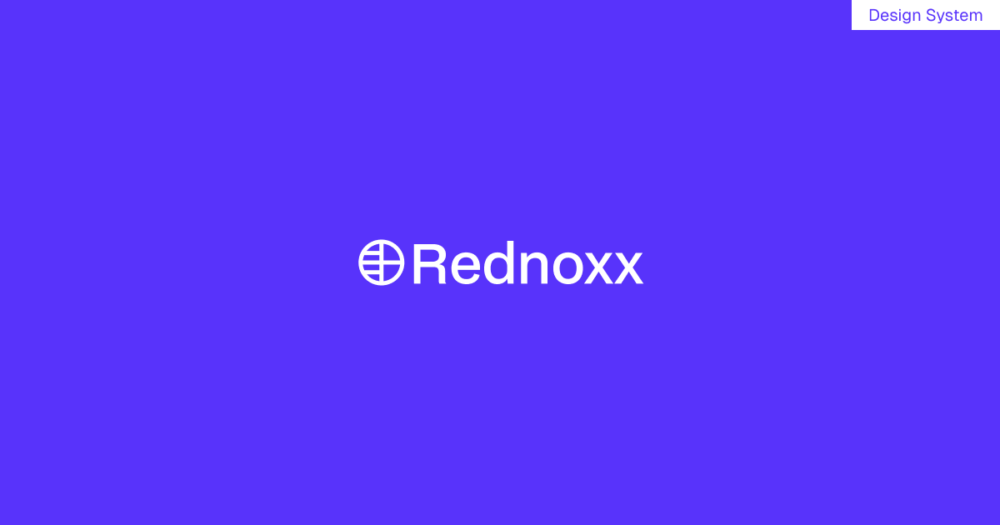

# Rednoxx — Healthcare Platform Design System



Rednoxx has grown into a broad healthcare platform spanning **enrolments, payments,
insurance, clinical consultation, prescriptions, lab and surgical orders, and
reporting**. As with most fast-growing products, features shipped faster than a
shared design language could keep up — leaving inconsistent components, uneven
spacing, unclear navigation, and gaps in feedback and accessibility.

## Repository layout

| Path | What it is |
|---|---|
| [`app/`](app/) | The design-system showcase (React + TypeScript + Vite + Tailwind v4) — foundations, the component library, and a live product demo. See [`app/README.md`](app/README.md) |
| [`docs/EHR-DESIGN-GUIDE.md`](docs/EHR-DESIGN-GUIDE.md) | The normative UI/UX & front-end implementation guide for the Rednoxx EHR — tokens, type scale, WCAG 2.2 AA gates, clinical safety patterns, FHIR mappings, testing protocol |

## Quick start

```bash
npm run setup   # install app dependencies
npm run dev     # http://localhost:5173
npm run build   # type-check + production build
npm run lint    # oxlint
```

## The component library

Thirty-six documented components, each with live examples and accessibility notes:

> Button (+ Button Group) · Input · Select · Combobox · DatePicker · Search ·
> Checkbox · Radio · Slider · Switch · Color picker · Digit input · Avatar
> (+ Avatar Group) · Badge · Card · Table · Progress (bar + circle) · Rating ·
> Divider · Kbd · Alert · Toast · Dialog · Drawer · Tooltip · Tabs (+ vertical) ·
> Segmented · Accordion · Stepper (horizontal · vertical · dots) · Pagination ·
> Breadcrumb · Sidebar · Navbar · Dropdown · Popover · Command menu

## Outcomes

- **A single design language.** One documented system applied consistently across the product.
- **Faster delivery.** New screens assembled from tested components, not designed from scratch.
- **Better usability.** Measurable improvement on the highest-traffic clinical and admin flows.
- **Accessibility.** WCAG 2.2 AA conformance across the core component library.
- **Longevity.** A governance model so the system stays healthy after handoff.
