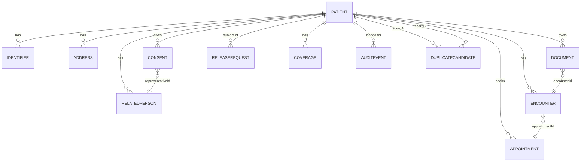

# REDNOXX HIM — Health Information Management Data Model (ERD)

This document is the markdown transcription of `HIM_ERD.pdf`. It describes the core patient-identity and health-information-management entities, their fields, and their relationships. `Patient` is the anchor entity — every other entity relates back to it, directly or (for `DuplicateCandidate`) twice over.

## Entity relationship diagram

## Entities

### Patient
Anchor entity for the entire HIM data model.

| Field | Type | Notes |
|---|---|---|
| id | string | **PK** |
| internalPatientId | string | |
| mrnNamespace | string | |
| familyName | string | |
| givenNames | string | |
| dateOfBirth | date | |
| estimatedAge | int | used when DOB is unknown/estimated |
| sex | string | |
| deceasedStatus | boolean | |
| deceasedDate | date | |
| recordStatus | string | e.g. active, merged, inactive |
| patientCategory | string | |
| createdAt | timestamp | |
| updatedAt | timestamp | |

### Identifier
Any identifier issued to a patient (national ID, health ID, facility MRN, etc.).

| Field | Type | Notes |
|---|---|---|
| id | string | **PK** |
| patientId | string | **FK →** Patient.id |
| identifierType | string | |
| system | string | issuing system/namespace |
| value | string | |
| issuer | string | |
| verificationStatus | string | |
| activeStatus | boolean | |
| startDate | date | |
| endDate | date | |
| source | string | |

### Address
| Field | Type | Notes |
|---|---|---|
| id | string | **PK** |
| patientId | string | **FK →** Patient.id |
| addressLine | string | |
| city | string | |
| state | string | |
| lga | string | Nigerian Local Government Area |
| ward | string | |
| country | string | |
| addressType | string | e.g. home, work, temporary |

### Consent
| Field | Type | Notes |
|---|---|---|
| id | string | **PK** |
| patientId | string | **FK →** Patient.id |
| status | string | |
| category | string | |
| representativeId | string | **FK →** RelatedPerson.id (consent given on patient's behalf) |
| scope | string | |
| consentDate | date | |
| source | string | |
| withdrawalDate | date | |

### RelatedPerson
Family members, guardians, or other individuals connected to the patient.

| Field | Type | Notes |
|---|---|---|
| id | string | **PK** |
| patientId | string | **FK →** Patient.id |
| name | string | |
| relationshipType | string | |
| phone | string | |
| address | string | |
| authorityStatus | boolean | authorized to act on patient's behalf |
| isGuardian | boolean | |
| identifierId | string | |

### Document
| Field | Type | Notes |
|---|---|---|
| id | string | **PK** |
| patientId | string | **FK →** Patient.id |
| encounterId | string | **FK →** Encounter.id |
| documentType | string | |
| fileMetadata | string | |
| status | string | |
| version | int | |
| confidentialityLevel | string | |
| uploadedBy | string | |
| uploadedAt | timestamp | |
| source | string | |

### Encounter
| Field | Type | Notes |
|---|---|---|
| id | string | **PK** |
| patientId | string | **FK →** Patient.id |
| visitNumber | string | |
| servicePoint | string | |
| payerCategory | string | |
| status | string | |
| startDate | timestamp | |
| appointmentId | string | **FK →** Appointment.id |
| endDate | timestamp | |

### Appointment
| Field | Type | Notes |
|---|---|---|
| id | string | **PK** |
| patientId | string | **FK →** Patient.id |
| scheduledDate | timestamp | |
| serviceType | string | |
| status | string | |
| clinicId | string | |

### ReleaseRequest
Requests for release/disclosure of patient records to a third party.

| Field | Type | Notes |
|---|---|---|
| id | string | **PK** |
| patientId | string | **FK →** Patient.id |
| requesterId | string | |
| authorityType | string | |
| purpose | string | |
| scope | string | |
| approvalStatus | string | |
| approvedBy | string | |
| releaseMethod | string | |
| feeLink | string | |
| createdAt | timestamp | |

### DuplicateCandidate
Candidate matches between two patient records, produced by de-duplication logic, pending HIM review.

| Field | Type | Notes |
|---|---|---|
| id | string | **PK** |
| recordAId | string | **FK →** Patient.id |
| recordBId | string | **FK →** Patient.id |
| matchScore | decimal | |
| matchingFields | string | |
| decision | string | e.g. merge, not-a-match, needs-review |
| reviewerId | string | |
| reason | string | |
| decidedAt | timestamp | |

### Coverage
Insurance/payer coverage for a patient.

| Field | Type | Notes |
|---|---|---|
| id | string | **PK** |
| patientId | string | **FK →** Patient.id |
| payerId | string | |
| insuranceNumber | string | |
| eligibilityStatus | string | |
| billingCategory | string | |
| startDate | date | |
| endDate | date | |

### AuditEvent
Immutable audit trail entry for actions taken on/around a patient record.

| Field | Type | Notes |
|---|---|---|
| id | string | **PK** |
| patientId | string | **FK →** Patient.id |
| actorId | string | |
| actorRole | string | |
| action | string | e.g. create, update, void, merge, export |
| timestamp | timestamp | |
| oldValue | string | |
| newValue | string | |
| reason | string | |
| deviceIp | string | |
| outcome | string | |

## Relationship summary

| From | To | Cardinality | Via |
|---|---|---|---|
| Patient | Identifier | 1 → many | Identifier.patientId |
| Patient | Address | 1 → many | Address.patientId |
| Patient | Consent | 1 → many | Consent.patientId |
| Consent | RelatedPerson | many → 1 | Consent.representativeId |
| Patient | RelatedPerson | 1 → many | RelatedPerson.patientId |
| Patient | Document | 1 → many | Document.patientId |
| Document | Encounter | many → 1 | Document.encounterId |
| Patient | Encounter | 1 → many | Encounter.patientId |
| Encounter | Appointment | many → 1 | Encounter.appointmentId |
| Patient | Appointment | 1 → many | Appointment.patientId |
| Patient | ReleaseRequest | 1 → many | ReleaseRequest.patientId |
| Patient | DuplicateCandidate | 1 → many (x2) | DuplicateCandidate.recordAId / recordBId |
| Patient | Coverage | 1 → many | Coverage.patientId |
| Patient | AuditEvent | 1 → many | AuditEvent.patientId |

## Notes for implementation

- `Patient.id` is the single anchor foreign key referenced by nearly every other table — treat `Patient` as the aggregate root for access control, audit scoping, and the Patient Context Banner data source (see `rednoxx-ehr-design` skill).
- `DuplicateCandidate` self-references `Patient` twice (`recordAId`, `recordBId`) — this is the backing table for the duplicate-detection and merge workflow described in `clinical-safety.md` (§2–3) of the REDNOXX design skill.
- `Consent.representativeId` and `Document.encounterId`/`Encounter.appointmentId` are the only non-Patient foreign keys in this model — everything else hangs directly off `Patient.id`.
- `AuditEvent` should be treated as append-only/immutable at the API layer, consistent with the auditability requirement in the REDNOXX design skill.
