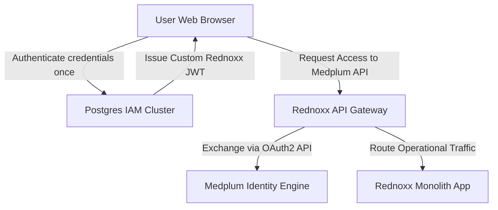
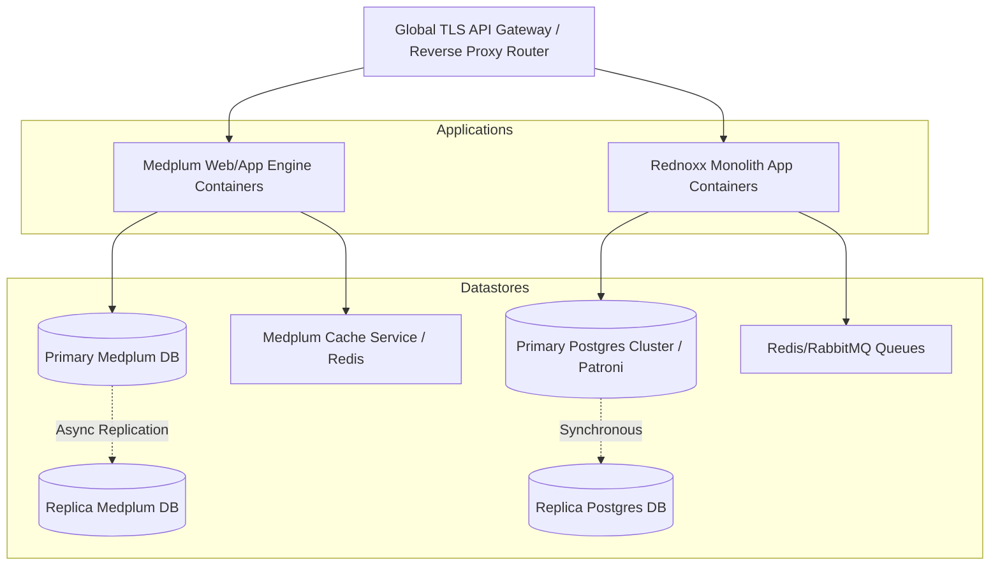

# PART II: Architecture Overview

## Purpose

This section defines the executive architecture, high-level system boundaries, and the dual-storage paradigm that dictates the entire REDNOXX EHR V1 implementation.

## Background

Historically, healthcare platforms struggle to balance high-volume financial and operational transactional needs with strict clinical standards conformance. This architecture is designed to bridge that historical incentive gap and completely eliminate the emergence of isolated health information silos within the facility.

## Architecture

### Vision

The strategic target architecture employs a dual-storage modular monolith framework. It strictly separates financial and operational transactional consistency from clinical data models, event workflows, and standards conformance.

### Architecture Principles

- **Strict Isolation:** Both the monolith application layer and the Medplum container images must run as isolated tasks within an elastic orchestrator.
- **Single Entry Point:** All incoming traffic passes through a global TLS API gateway that manages SSL termination, routing paths, and security policies.
- **Data Partitioning:** The system establishes a strict data partitioning line to preserve transactional integrity; there are no direct cross-database writes between the relational Postgres engine and the Medplum FHIR graph.

### Design Decisions: Dual Storage Philosophy

The architecture relies on two explicitly partitioned persistence engines to handle domain-specific workflows:

1. **Postgres:** The authoritative relational database engine used for Identity & Access Management (IAM), facility configurations, and revenue cycle processing.
2. **Medplum:** The authoritative clinical graph and automation engine, utilizing a native PostgreSQL FHIR schema to handle the Master Patient Index (MPI), encounters, observations, and clinical audits.

### C4 Context Diagram

**Diagram Note:** Unified Single Sign-On (SSO) & SMART-on-FHIR Token Exchange Pipeline.

### C4 Container Diagram

**Diagram Note:** Target Deployment Infrastructure Architecture detailing isolated application containers and database subsystems.

## Technical Specification

### Core Schema & Resource Partitioning Matrix

The enterprise architecture segregates data storage by operational domain, domain capability, and storage subsystem:

| Operational Domain | Domain Entity / Sub-System  | Primary Datastore | Persistence Engine / Model                        | Interoperability Representation      |
| ------------------ | --------------------------- | ----------------- | ------------------------------------------------- | ------------------------------------ |
| IAM & Governance   | Identity Accounts & MFA     | Postgres          | Relational Tables (`users`, `mfa_factors`)        | Custom JWT Claims                    |
| IAM & Governance   | RBAC Matrices & Scopes      | Postgres          | Relational Tables (`roles`, `permissions`)        | Medplum AccessPolicy                 |
| Facility Config    | Location & Org Hierarchy    | Postgres          | Relational Tables (`facilities`, `wards`, `beds`) | FHIR Organization / Location         |
| Revenue Cycle      | Service Catalogues & Rules  | Postgres          | Relational Tables (`services`, `charge_items`)    | FHIR ChargeItemDefinition            |
| Revenue Cycle      | Tariffs & Pricing Models    | Postgres          | Relational Tables (`tariffs`, `payer_rules`)      | Custom Extension Matrix              |
| Revenue Cycle      | Invoicing & Payment Ledgers | Postgres          | Relational Tables (`invoices`, `payments`)        | FHIR Invoice / Account (Read Model)  |
| Revenue Cycle      | Payer Registries & Claims   | Postgres          | Relational Tables (`claims`, `remittances`)       | FHIR Claim / ClaimResponse           |
| Clinical Core      | Master Patient Index (MPI)  | Medplum           | PostgreSQL (FHIR Schema)                          | FHIR Patient / Person                |
| Clinical Core      | Encounters & Admissions     | Medplum           | PostgreSQL (FHIR Schema)                          | FHIR Encounter / EpisodeOfCare       |
| Clinical Core      | Structured Observations     | Medplum           | PostgreSQL (FHIR Schema)                          | FHIR Observation (LOINC/SNOMED)      |
| Clinical Core      | Clinical Notes & Uploads    | Medplum           | PostgreSQL (FHIR Schema) & S3                     | FHIR DocumentReference / Composition |
| Clinical Core      | Privacy Consents            | Medplum           | PostgreSQL (FHIR Schema)                          | FHIR Consent                         |
| Clinical Core      | Clinical Audit Backbone     | Medplum           | PostgreSQL (FHIR Schema)                          | FHIR AuditEvent / Provenance         |

## Implementation Notes

- Container orchestration via Docker natively supports the Node.js/TypeScript environment required for Medplum bots and subscriptions, ensuring seamless deployment parity.
- Local development environments must spin up the complete dual-storage stack via Compose to ensure developers test cross-database logic before pushing to staging.

## Risks

- **Data Synchronization Mismatch:** Strict data partitioning creates a risk of state mismatch between the financial ledger and the clinical graph if asynchronous cross-database communication is dropped or stalled.

## Dependencies

- **Postgres:** Required for atomic transactional locking, RBAC, and revenue cycle processing.
- **Medplum:** Required for FHIR R4 schema enforcement and SMART-on-FHIR OAuth2 token exchange.
- **RabbitMQ/Redis:** Required for asynchronous outbox event routing and Medplum cache services.

## References

- AGILE DELIVERY PLAN.docx
