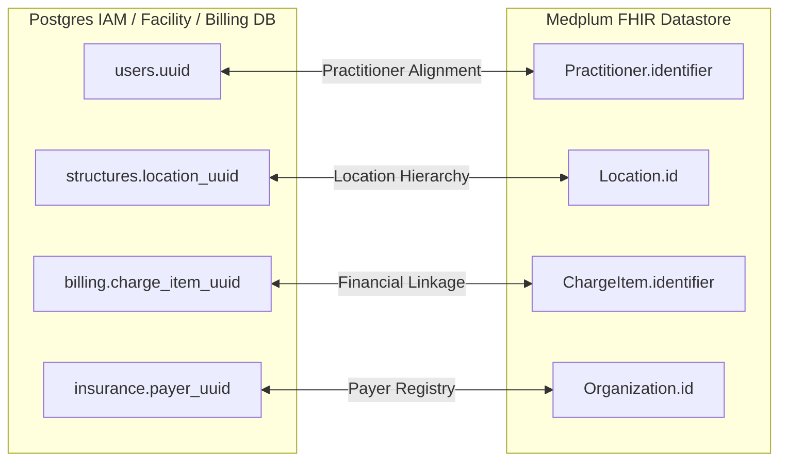

# PART III: Canonical Data Architecture

## Purpose

This section defines the Canonical Data Architecture for REDNOXX EHR V1, establishing the authoritative ownership, logical identifier reference rules, and cross-database synchronization boundaries between Postgres and Medplum.

## Background

Because the architecture employs a dual-storage modular monolith framework, standard relational foreign keys cannot be used to link financial, operational, and clinical records. To maintain system-wide relational cohesion and prevent isolated health information silos, a shared canonical data model must enforce strict synchronization and logical identity mapping across the data partitioning line.

## Architecture

Cross-system relational cohesion is achieved entirely via strict reference mapping using immutable logical keys. Absolutely no foreign keys cross the database instances. The shared canonical model maps these identities using explicit synchronization constraints to guarantee integrity across the distributed persistence engines.

### Cross-Database Relationship Boundaries

**Diagram Note:** The shared canonical model maps identities using explicit synchronization constraints without hard foreign keys.

## Technical Specification

The enterprise architecture enforces the following logical reference rules across the system boundaries:

- **Practitioner Alignment Boundary:** A `user.uuid` generated in the Postgres IAM database serves as the authoritative unique string. This UUID must directly match the `Practitioner.identifier` field within the Medplum FHIR graph.
- **Location Hierarchy Boundary:** Wards and beds are configured inside the Postgres structural layout using UUIDs. These structural UUIDs are mapped directly to FHIR `Location` resources via `Location.identifier` arrays inside Medplum.
- **Financial Linkage Boundary:** Every operational financial line item created in Postgres must log the corresponding clinical resource reference (e.g., `ServiceRequest`, `MedicationDispense`, or `Procedure`) within its metadata payload. This guarantees that clinical evidence is verified for every generated claim.
- **Payer Registry Boundary:** Insurance payers registered in Postgres (`insurance.payer_uuid`) must map directly to the corresponding FHIR `Organization.id` inside Medplum to facilitate accurate claims processing.

## Implementation Notes

- Logical identifiers (UUIDs) mapped across boundaries must be treated as immutable.
- Updates to demographic or structural entities in the Postgres database must immediately trigger the asynchronous outbox processor to synchronize the equivalent FHIR resource attributes in Medplum.

## Risks

- **Dangling Logical References:** If the asynchronous outbox worker fails and the Dead-Letter Queue (DLQ) is not monitored, logical keys may exist in one database without their corresponding resource in the other, breaking the Master Patient Index (MPI) or financial linkages.

## Dependencies

- **Postgres IAM / Facility DB:** Serves as the authoritative source of truth for user identities and structural facility locations.
- **Medplum FHIR Datastore:** Serves as the authoritative destination for mapped clinical equivalents (`Practitioner`, `Location`, `Organization`).

## References

- AGILE DELIVERY PLAN.docx
