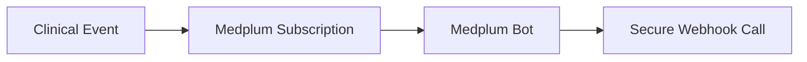

# PART IV: FHIR Architecture

## Purpose

This section defines the comprehensive FHIR architecture managed within Medplum. It details the specific AccessPolicy configurations, Subscription triggers, and automated Bot execution engines that drive the clinical workflows and maintain strict interoperability standards.

## Background

The Medplum instance functions as our configurable clinical repository. Instead of relying on hardcoded application logic, access control and automation are driven directly by native FHIR resources and JSON policies. This ensures the clinical core remains strictly aligned with international interoperability standards.

## Architecture

High-risk clinical events initiate asynchronous integrations through Medplum Subscription resources. These resources route to target JavaScript/TypeScript Bot execution engines to process cross-domain actions.



**Diagram Note:** Medplum Subscriptions & Bot Automation Architecture pipeline.

## Technical Specification

### Tertiary Hospital RBAC Matrix Integration via AccessPolicies

To map the tertiary hospital RBAC matrix safely, Medplum AccessPolicy resources utilize criteria-based search restrictions.

#### HIM Officer Policy (AccessPolicy/him-officer-policy)

- **Purpose:** Enforces access boundaries for Health Information Management officers, restricting encounter visibility based on status.
- **Example:**

```json
{
    "resourceType": "AccessPolicy",
    "id": "him-officer-policy",
    "name": "HIM Officer Access Policy",
    "resource": [
        {
            "resourceType": "Patient",
            "access": "read-write"
        },
        {
            "resourceType": "Person",
            "access": "read-write"
        },
        {
            "resourceType": "Encounter",
            "access": "read",
            "criteria": "Encounter?status=planned,arrived,in-progress"
        },
        {
            "resourceType": "DocumentReference",
            "access": "read-write"
        },
        {
            "resourceType": "AuditEvent",
            "access": "write"
        }
    ]
}
```

- **Explanation:** The policy grants read-write access to core identity (`Patient`, `Person`) and documentation (`DocumentReference`) resources, while heavily restricting `Encounter` visibility to active or planned states using specific search criteria.
- **Production Notes:** `AuditEvent` resources are strictly write-only to prevent tampering by administrative users.

#### Clinical Practitioner Policy (AccessPolicy/clinical-practitioner-policy)

- **Purpose:** Defines the broad read-write access required by clinical staff to document care and place orders.
- **Example:**

```json
{
    "resourceType": "AccessPolicy",
    "id": "clinical-practitioner-policy",
    "name": "Clinical Practitioner Access Policy",
    "resource": [
        {
            "resourceType": "Patient",
            "access": "read-write"
        },
        {
            "resourceType": "Encounter",
            "access": "read-write"
        },
        {
            "resourceType": "Condition",
            "access": "read-write"
        },
        {
            "resourceType": "Observation",
            "access": "read-write"
        },
        {
            "resourceType": "MedicationRequest",
            "access": "read-write"
        },
        {
            "resourceType": "ServiceRequest",
            "access": "read-write"
        },
        {
            "resourceType": "DiagnosticReport",
            "access": "read-write"
        },
        {
            "resourceType": "Consent",
            "access": "read"
        },
        {
            "resourceType": "Provenance",
            "access": "read-write"
        }
    ]
}
```

- **Explanation:** Provides full clinical documentation capabilities across conditions, observations, medication requests, and diagnostic reports.
- **Production Notes:** `Consent` records are restricted to read-only access to prevent unauthorized modification of privacy preferences by clinical staff.

#### Billing Officer Policy (AccessPolicy/billing-officer-policy)

- **Purpose:** Restricts financial staff to view-only access for clinical contexts while allowing modification of financial resources.
- **Example:**

```json
{
    "resourceType": "AccessPolicy",
    "id": "billing-officer-policy",
    "name": "Billing Officer Access Policy",
    "resource": [
        {
            "resourceType": "Patient",
            "access": "read"
        },
        {
            "resourceType": "Encounter",
            "access": "read"
        },
        {
            "resourceType": "ChargeItem",
            "access": "read-write"
        },
        {
            "resourceType": "Claim",
            "access": "read-write"
        },
        {
            "resourceType": "Coverage",
            "access": "read"
        }
    ]
}
```

- **Explanation:** Grants write access strictly to `ChargeItem` and `Claim` resources, ensuring clinical data (`Patient`, `Encounter`, `Coverage`) is referenced but not altered.
- **Production Notes:** Essential for enforcing the separation of concerns between clinical care and revenue cycle management.

### Medplum Subscriptions & Bot Automation

#### 1. Encounter Creation Engine

- **Purpose:** Automatically triggers the financial integration sequence whenever a new clinical encounter is generated.
- **Example:**

```json
{
    "resourceType": "Subscription",
    "reason": "Trigger webhook on Encounter creation",
    "status": "active",
    "criteria": "Encounter?_interaction=create",
    "channel": {
        "type": "rest-hook",
        "endpoint": "Bot/encounter-sync-bot"
    }
}
```

- **Explanation:** Intercepts any create interaction on the `Encounter` resource and forwards it to the designated bot.
- **Production Notes:** The bot logic verifies the active `Encounter.location` assignment, extracts client identifiers, and sends a secure webhook payload to the Postgres financial queue to initialize an operational billing encounter.

#### 2. Critical Result Escalation Engine

- **Purpose:** Automates the escalation of high-priority laboratory or radiology findings.
- **Example:**

```json
{
    "resourceType": "Subscription",
    "reason": "Trigger on high-priority critical observations",
    "status": "active",
    "criteria": "Observation?interpretation=CRT",
    "channel": {
        "type": "rest-hook",
        "endpoint": "Bot/critical-alert-bot"
    }
}
```

- **Explanation:** Filters for `Observation` resources flagged with a critical (`CRT`) interpretation code.
- **Production Notes:** The bot intercepts the result, constructs a message payload containing visual indicators, and posts it to the clinical care coordination worklist. If unacknowledged within 15 minutes, it routes the alert to the supervisory dashboard.

#### 3. Duplicate Candidate Matching Engine

- **Purpose:** Continuously monitors demographic updates to identify potential duplicate patient profiles in real time.
- **Example:**

```json
{
    "resourceType": "Subscription",
    "reason": "Trigger on demographic change for duplicate validation",
    "status": "active",
    "criteria": "Patient",
    "channel": {
        "type": "rest-hook",
        "endpoint": "Bot/duplicate-matcher-bot"
    }
}
```

- **Explanation:** Listens to all updates on the `Patient` resource to evaluate deterministic and probabilistic matching metrics.
- **Production Notes:** Evaluates match criteria using names, sex, and birth date configurations. High-confidence matches generate a Linkage resource flag and update the HIM supervisor's queue.

### Interoperability Terminology Standardization

- **Diagnostic Codification:** Test requests map directly to unique LOINC identifiers, ensuring consistent terminology across clinical reports.
- **Clinical Finding Representation:** Diagnoses, allergies, and clinical assessments map to SNOMED-CT concepts within the data store.
- **Validation:** Strict value-set validation checks are enforced on all incoming fields for these resources.

## Implementation Notes

- Bots are executed as isolated JavaScript/TypeScript functions within the Medplum environment.
- All `AccessPolicy` rules map dynamically to the user's roles provided via the SMART-on-FHIR token exchange during the initial authentication handshake.

## Risks

- **Scope Creep in Policies:** Improperly tested modifications to `AccessPolicy` criteria fields could unintentionally expose broad sets of protected health information (PHI) to unauthorized user groups.
- **Bot Execution Timeouts:** Heavy deterministic matching logic within the Duplicate Candidate Matching Engine must be optimized to prevent webhook timeouts.

## Dependencies

- **Medplum FHIR Server:** Required for executing the native subscriptions and applying the `AccessPolicy` filters.
- **Postgres IAM / Facility DB:** Receives the secure webhook payloads generated by the Medplum Bots to initiate outbox workflows.

## References

- AGILE DELIVERY PLAN.docx
