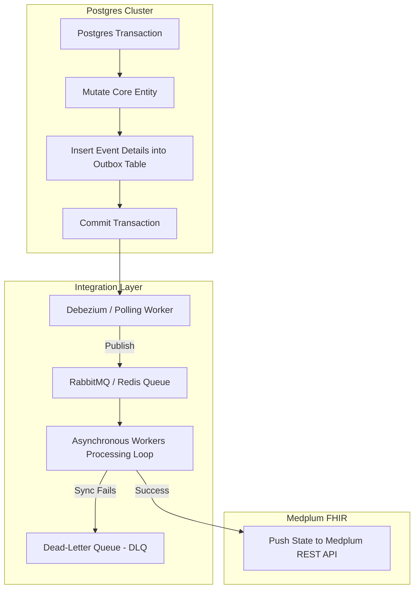
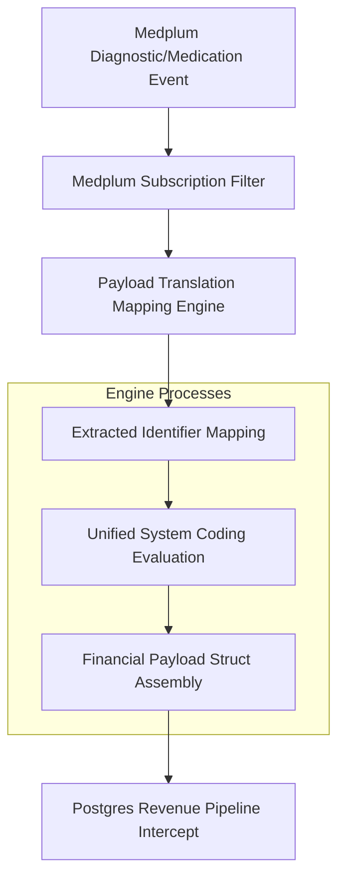

# PART V: Integration Architecture

## Purpose

This section defines the asynchronous integration architecture, outbox routing patterns, and event translation mechanics for REDNOXX EHR V1. It establishes the exact protocols for maintaining state synchronization across the system without introducing database locks.

## Background

To prevent transaction locks and coordinate cross-database state validation safely, the system uses an atomic, asynchronous outbox framework. This ensures that high-volume financial processing and clinical graph updates occur reliably without blocking the primary application threads.

## Architecture

### Asynchronous Outbox Pipeline



**Diagram Note:** The asynchronous sync workflow mapping Postgres transactions to Medplum FHIR updates.

### Clinical Event Translation Engine



**Diagram Note:** Translation mechanics routing Medplum clinical actions to the Postgres charge pipeline.

## Technical Specification

### Asynchronous Sync Workflows & Outbox Subsystems

When an administrative or financial state shift takes place within the Postgres cluster, the system executes the following outbox routine:

1. The operational query writes changes to the target functional tables (e.g., `invoices`, `payments`) within an atomic database transaction.
2. Simultaneously, it inserts event serialization details into an `outbox_events` logging table before confirming the database commit.
3. A separate outbox processor (such as Debezium or a dedicated backend service worker) reads these entries sequentially, broadcasts the message across our RabbitMQ message architecture, and flags the row as processed.
4. Independent worker daemons pick up the message payload, map it to standard FHIR formats, and safely update the Medplum server using secure system access keys.
5. If transmission faults happen, the item moves to a Dead-Letter Queue (DLQ). The system tracks the error state, keeps the transaction from stalling, and alerts the enterprise operations dashboard.

### API Contracts & UI Synchronization

To ensure the client applications interface seamlessly with these asynchronous states, API contracts must be strictly versioned and rigorously documented. This guarantees that John and the frontend engineering team can accurately consume the asynchronous payloads and handle loading states, ensuring that Victoria's UI/UX designs for the clinical and billing dashboards remain completely synchronized with the eventual backend state.

### Clinical Event Translation Mechanics (Medplum to Postgres)

#### 1. Inbound Resource Event Payload

- **Purpose:** Medplum triggers a secure webhook payload transmitting the exact status state of the clinical action.
- **Example:**

```json
{
    "resourceType": "MedicationDispense",
    "id": "dispense-example-101",
    "status": "completed",
    "medicationCodeableConcept": {
        "coding": [
            {
                "system": "http://rednoxx.com/codes/pharmacy-inventory",
                "code": "PHAR-IV-CEF-500MG"
            }
        ]
    },
    "subject": {
        "reference": "Patient/fc3b92c4"
    },
    "context": {
        "reference": "Encounter/enc-992a"
    },
    "performer": [
        {
            "actor": {
                "reference": "Practitioner/prac-007"
            }
        }
    ],
    "quantity": {
        "value": 2,
        "unit": "vial"
    }
}
```

- **Explanation:** The raw FHIR JSON output generated when a `MedicationDispense` is finalized by a pharmacist, encapsulating the clinical code, patient context, encounter, and dispensed quantity.
- **Production Notes:** Webhook endpoints receiving this payload must validate the signature to ensure the event originated strictly from the Medplum server.

#### 2. Translation & Structural Mapping

- **Purpose:** The translation component transforms the FHIR representation into a clean, relational financial transaction structure.
- **Example:**

```json
{
    "event_type": "CLINICAL_CHARGE_CAPTURE",
    "source_system": "MEDPLUM_FHIR_SERVER",
    "source_event_id": "dispense-example-101",
    "patient_identifier": "fc3b92c4",
    "encounter_identifier": "enc-992a",
    "service_code": "PHAR-IV-CEF-500MG",
    "quantity_rendered": 2,
    "rendered_by_practitioner": "prac-007",
    "timestamp": "2026-07-06T02:18:00Z"
}
```

- **Explanation:** The engine executes extracted identifier mapping, unified system coding evaluation, and financial payload struct assembly.
- **Production Notes:** Every translated payload must contain an idempotent `source_event_id` to prevent duplicate billing charges if the message queue retries the delivery.

#### 3. Postgres Processing Workflow

- **Purpose:** The revenue pipeline intercepts the translation payload, resolves exact pricing rules using the active system configuration, and inserts the charge line item to verify capture tracking.

- **Execution Flow:**
    1. Select the current active tariff price based on the inbound `service_code`.
    2. Insert a new record into `billing.charge_items` with an `UNBILLED` status.

- **SQL:**

```sql
-- 1. Resolve exact pricing rules using the active system configuration
SELECT price, tariff_id
FROM billing.tariffs
WHERE service_code = 'PHAR-IV-CEF-500MG'
  AND status = 'active'
  AND effective_date <= NOW()
ORDER BY effective_date DESC
LIMIT 1;

-- 2. Insert the charge line item to verify capture tracking
INSERT INTO billing.charge_items (
    uuid,
    encounter_uuid,
    patient_uuid,
    service_code,
    quantity,
    unit_price,
    total_charge,
    status,
    created_at
) VALUES (
    gen_random_uuid(),
    'enc-992a',
    'fc3b92c4',
    'PHAR-IV-CEF-500MG',
    2,
    v_price,
    (2 * v_price),
    'UNBILLED',
    NOW()
);
```

- **Discussion:** This query strictly enforces temporal pricing rules by validating the `effective_date` before applying the calculated `total_charge` to the patient's billing encounter.
- **Failure Modes:** If the `SELECT` query returns `NULL` (e.g., the service code is unregistered or the tariff has expired), the pipeline must reject the `INSERT` operation, roll back the transaction, and route the raw event into the Dead-Letter Queue (DLQ) for administrative billing review.

## Implementation Notes

- Ensure all RabbitMQ channels require explicit consumer acknowledgments (ACKs) only after the Postgres transaction commits successfully.
- Retry mechanisms must implement exponential backoff to prevent system flooding during temporary database unavailability.

## Risks

- **Message Duplication:** Asynchronous queues guarantee at-least-once delivery; without strict idempotency key validation on the Postgres side, patients could be double-billed for a single clinical event.
- **DLQ Neglect:** Unmonitored Dead-Letter Queues will result in silent revenue leakage if failed clinical translation payloads are not reconciled.

## Dependencies

- **RabbitMQ / Redis:** Required for maintaining the durable event queues and routing asynchronous payloads.
- **Debezium (Optional/Recommended):** Recommended for tailing the Postgres Write-Ahead Log (WAL) to ensure zero-loss outbox processing.

## References

- AGILE DELIVERY PLAN.docx
