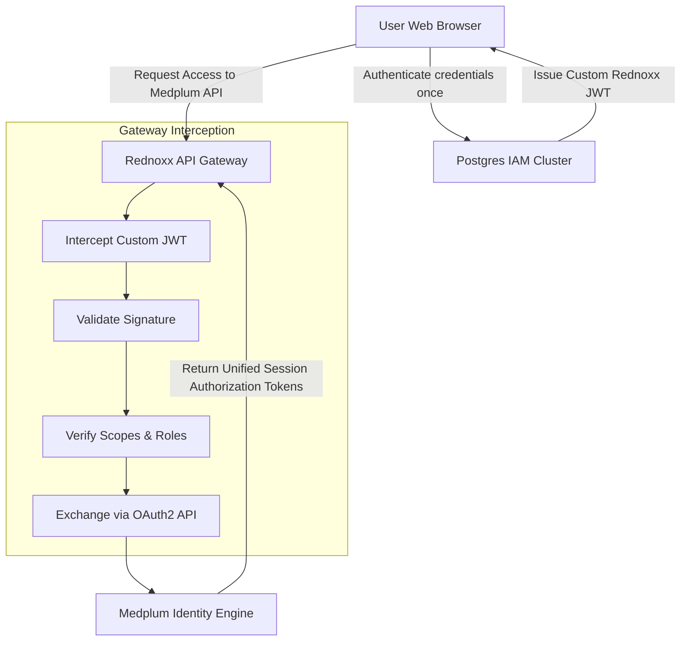
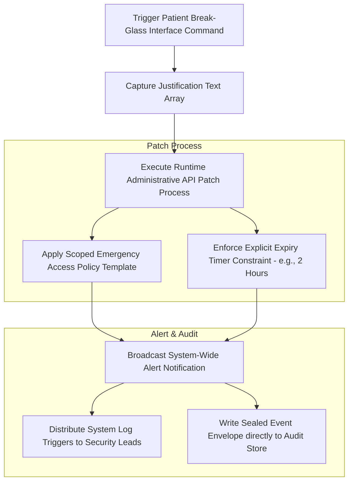

# PART VI: Security Architecture

## Purpose

This section defines the comprehensive security architecture, outlining the strict security perimeter, centralized authentication flows, and the tamper-evident audit trail across the dual-storage persistence systems. It establishes the exact mechanics for IAM, RBAC, OAuth token exchange, and emergency access protocols.

## Background

To protect data confidentiality and ensure clinical safety, the system must establish a strict security perimeter without compromising the user experience of the clinical staff. The architecture separates authentication from deployment constraints, consolidating Identity and Access Management (IAM) inside Postgres while driving granular resource access via SMART-on-FHIR policies inside Medplum.

## Architecture

### Unified Single Sign-On (SSO) & SMART-on-FHIR Token Exchange Pipeline



**Diagram Note:** To prevent double authentication prompts, the API gateway uses an encrypted token exchange workflow.

### High-Risk Break-Glass Workflow



**Diagram Note:** Emergency Break-Glass Execution pipeline for handling unconscious patients arriving without pre-configured records.

## Technical Specification

### Identity & Access Management (IAM) and Authentication

1. **Primary Authentication Step:** The client submits credentials to the custom Postgres IAM engine, which verifies factors and issues an encrypted Rednoxx JWT containing specific role and security definitions.

2. **Gateway Interception Step:** When accessing clinical resources, the client requests data through the API gateway. The gateway validates the signature and reads the user's role attributes.

3. **OAuth2 Back-Channel Exchange Step:** The gateway submits the internal token to Medplum's token endpoint (`/oauth/token`) using a secure machine-to-machine client identifier.

4. **Target Scoped Resource Provisioning Step:** Medplum maps the user's role array to the corresponding system AccessPolicy, generating a short-lived SMART-on-FHIR token. This grants single-sign-on validation across the entire session.

5. **MFA Baseline Enforcement:** Privileged access configurations (such as system administration, financial adjustments, or bulk data operations) require an active Time-Based One-Time Password (TOTP) validation step before granting access.

### Immutable, Tamper-Evident Security Log Backbone

Every system read, write, modification, or adjustment writes an unalterable audit log entry across both primary storage engines. The architecture tracks structural actions using two primary FHIR logging resources.

#### 1. AuditEvent Resource Implementation

- **Purpose:** Logs the technical context of system interactions, capturing access events, resource updates, and privileged modifications.

- **Example:**

```json
{
    "resourceType": "AuditEvent",
    "id": "audit-evt-4402a",
    "recorded": "2026-07-06T02:18:00Z",
    "type": {
        "system": "http://terminology.hl7.org/CodeSystem/audit-event-type",
        "code": "rest"
    },
    "action": "U",
    "outcome": "0",
    "agent": [
        {
            "id": "prac-007",
            "role": [
                {
                    "coding": [
                        {
                            "system": "http://rednoxx.com/roles",
                            "code": "ROLE-009"
                        }
                    ]
                }
            ],
            "requestor": true
        }
    ],
    "source": {
        "observer": {
            "reference": "Device/gateway-router-prod"
        }
    },
    "entity": [
        {
            "what": {
                "reference": "Patient/fc3b92c4"
            },
            "type": {
                "system": "http://terminology.hl7.org/CodeSystem/audit-entity-type",
                "code": "1"
            }
        }
    ]
}
```

- **Explanation:** This JSON payload tracks an update (`action: "U"`) on a specific patient entity (`Patient/fc3b92c4`), noting a successful outcome (`outcome: "0"`) performed by a designated practitioner (`prac-007`) routed through the production gateway.

- **Production Notes:** Audit records must be configured as write-only in all base access policies to prevent post-event modifications or deletions.

#### 2. Provenance Resource Implementation

- **Purpose:** Tracks structural clinical changes, ensuring clear accountability by mapping operations back to specific agents, organizational units, and source activities.

- **Example:**

```json
{
    "resourceType": "Provenance",
    "id": "prov-obs-9921",
    "target": [
        {
            "reference": "Observation/obs-9912a"
        }
    ],
    "recorded": "2026-07-06T02:18:00Z",
    "activity": {
        "coding": [
            {
                "system": "http://terminology.hl7.org/CodeSystem/v3-DocumentCompletion",
                "code": "AU"
            }
        ]
    },
    "agent": [
        {
            "type": {
                "coding": [
                    {
                        "system": "http://terminology.hl7.org/CodeSystem/provenance-participant-type",
                        "code": "author"
                    }
                ]
            },
            "who": {
                "reference": "Practitioner/prac-007"
            }
        }
    ],
    "signature": [
        {
            "type": [
                {
                    "system": "urn:iso-astm:E1762-95:2013",
                    "code": "1.2.840.10065.1.12.1.1"
                }
            ],
            "when": "2026-07-06T02:18:00Z",
            "who": {
                "reference": "Practitioner/prac-007"
            },
            "data": "aGJnZ2ZoYmRnZmhnYmRnZmhnYmRn..."
        }
    ]
}
```

- **Explanation:** Maps the creation or modification of a clinical target (`Observation/obs-9912a`) directly to the authoring agent and includes a base64-encoded cryptographic signature of the action.

- **Production Notes:** Required for non-repudiation in clinical documentation and crucial for supporting addendum/amendment tracking across patient notes.

## Implementation Notes

- Emergency access ("Break-Glass") functionality changes system behavioral logic using a high-security access pipeline. The UI must enforce the capture of the justification text array before patching the runtime administrative API.
- The API gateway must securely manage the internal OAuth2 machine-to-machine client identifiers to prevent token hijacking.

## Risks

- **Token Exposure:** If the short-lived SMART-on-FHIR tokens are leaked or logged improperly at the gateway level, they could grant unauthorized data access until their expiration.
- **Break-Glass Abuse:** Without stringent retrospective auditing by security leads, the emergency access workflow could be exploited to bypass standard RBAC controls.

## Dependencies

- **Postgres IAM Cluster:** The authoritative engine for verifying user credentials, TOTP factors, and generating the initial Rednoxx JWT.
- **Rednoxx API Gateway:** The central routing node responsible for intercepting JWTs, validating signatures, and negotiating the OAuth2 token exchange.
- **Medplum Identity Engine:** Issues the SMART-on-FHIR tokens and enforces the AccessPolicy boundaries mapped to the roles.

## References

- AGILE DELIVERY PLAN.docx
