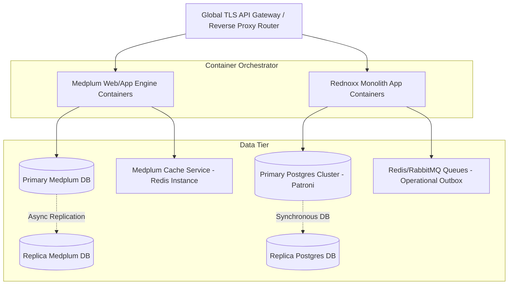
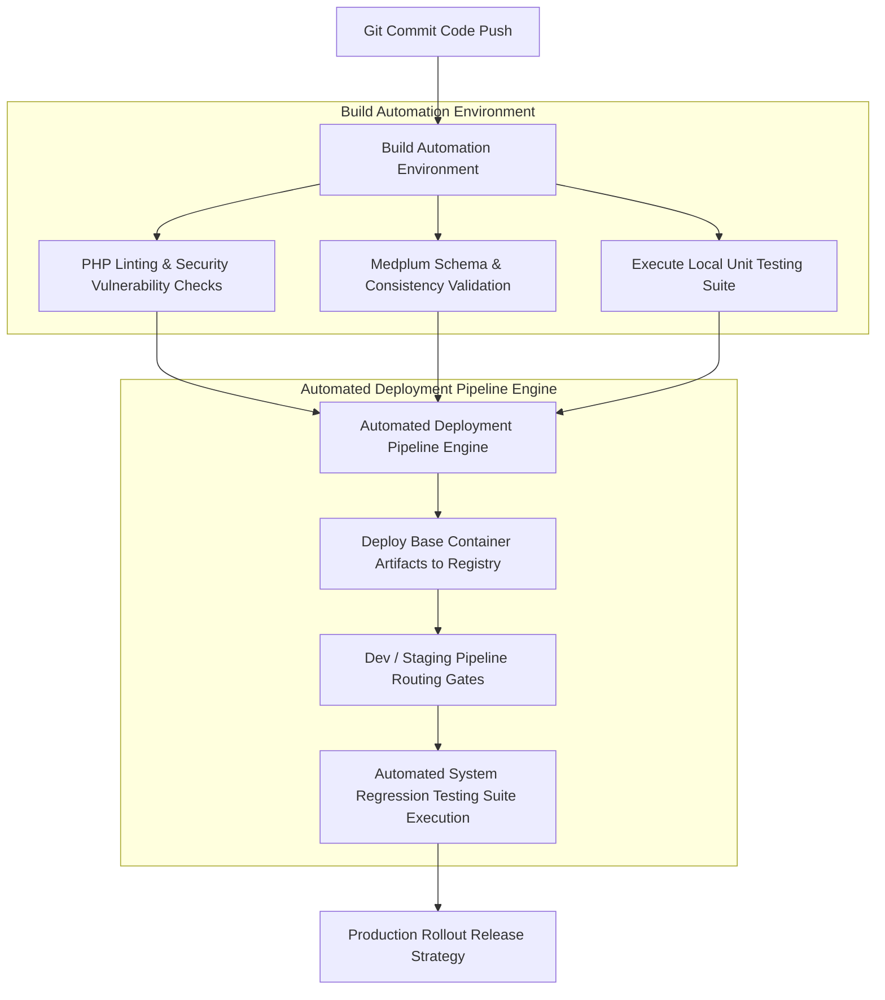
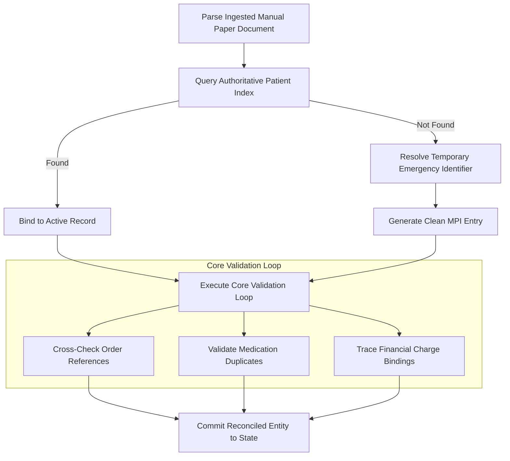

# PART VII: Deployment Architecture

## Purpose

This section defines the deployment architecture, infrastructure topology, CI/CD pipeline automation, and operational resilience mechanisms for REDNOXX EHR V1. It establishes the exact protocols for disaster recovery, backups, and downtime reconciliation to guarantee high availability.

## Background

To ensure continuous operation in a high-volume tertiary hospital environment, the deployment strategy cannot rely on a single point of failure. The target deployment model uses isolated containers, isolated customer database schemas, and structured deployment stages to ensure high availability and structural recovery.

## Architecture

### Target Deployment Infrastructure Architecture

**Diagram Note:** Application and Database Subsystem isolation layers ensuring high availability.

### CI/CD Pipeline Automation

**Diagram Note:** The automation framework coordinating validation steps across isolated environments.

### Post-Downtime Data Reconciliation Subsystem

**Diagram Note:** The validation logic processing loop executed when recovering from degraded-state paper fallbacks.

## Technical Specification

### Application & Database Isolation Context

- **Application Isolation:** Both the Rednoxx monolith application layer and the Medplum container images run as isolated tasks within an elastic orchestrator. Traffic passes through an API gateway that manages SSL termination, routing paths, and security policies.
- **Database Subsystem Architecture:** The main Postgres cluster uses Patroni to coordinate synchronous high-availability clusters. The Medplum operational datastore uses an isolated PostgreSQL instance configured with asynchronous read replicas to protect production read performance.

### CI/CD Pipeline Configuration Requirements

The automation framework coordinates validation steps across isolated environments:

- **Dev Environment:** Commits automatically trigger deployments to provide functional sandboxes for feature evaluation.
- **Staging Environment:** Runs integration, load, and performance tests against structural test cases. Passing these tests is required before manual release gates allow updates to move to production.
- **Production Environment:** Deployments utilize blue-green rollout strategies. Automated health checks verify container stability before routing live production traffic to the new instances.

### Operational Resilience, Recovery, & Backup Matrix

To preserve operational continuity during system infrastructure issues, the architecture enforces strict Recovery Point Objectives (RPO) and Recovery Time Objectives (RTO):

| Subsystem Domain          | Target RPO                   | Target RTO   | Backup Validation & Verification Cadence                    | Architectural Resilience Strategy                   |
| ------------------------- | ---------------------------- | ------------ | ----------------------------------------------------------- | --------------------------------------------------- |
| **IAM & System Security** | ≤ 0 seconds (Zero Data Loss) | ≤ 30 seconds | Daily automated database verification snapshots.            | Multi-zone synchronous configuration loops.         |
| **Financial / Billings**  | ≤ 0 seconds (Zero Data Loss) | ≤ 5 minutes  | Point-in-time recovery (PITR) log parsing every 15 minutes. | High-integrity write-ahead logging (WAL) pipelines. |
| **Clinical Registries**   | ≤ 1 minute                   | ≤ 15 minutes | Daily structural database integrity runs.                   | Multi-replica asynchronous replication arrays.      |
| **Operational Reporting** | ≤ 24 hours                   | ≤ 4 hours    | Weekly execution validation processes.                      | Read-model extract separation boundaries.           |

### Degraded-State Paper Fallback Procedures

When infrastructure disruptions block access to the production application cluster:

1. **Operational Downtime Activation:** Supervisory roles shift operations to standardized manual fallback templates for registration, vitals, ordering, and financial tracking.
2. **Downtime Identifier Tracking:** Every manual paper form must be stamped with an emergency sequential tracking identifier matching the format `DT-YYYYMMDD-[FacilityCode]-NNNN`.
3. **Queue Ingestion & Processing:** Once systems recover, a specialized administration console initializes an empty data reconciliation queue, and records staff enter the historical manual paper documents chronologically. The ingestion logic then executes strict validation checks before committing the entity to state.

## Implementation Notes

- Blue-green deployments require strict schema backwards compatibility. Any database migration deployed to the staging environment must be non-destructive to ensure the old version of the application can continue running against the updated schema during the rollout phase.
- The reconciliation queue UI must clearly flag any validation failures (e.g., mismatched medication duplicates) to the administrative staff to prevent corrupting the MPI.

## Risks

- **Downtime Reconciliation Bottlenecks:** If a downtime event lasts several hours, the volume of manual paper documents could overwhelm the reconciliation processing loop, resulting in a lag between actual clinical state and digital records.
- **Sync Lag During Failover:** Asynchronous read replicas for the Medplum datastore might exhibit temporary replication lag under heavy load. If a failover is forced during this window, up to 1 minute of non-critical clinical registry data could be lost, adhering to the ≤ 1 minute RPO tolerance.

## Dependencies

- **Patroni:** Required for managing the primary Postgres synchronous cluster and executing automated failovers.
- **API Gateway:** Required for executing the blue-green rollout strategies by seamlessly shifting traffic between application container clusters.

## References

- AGILE DELIVERY PLAN.docx
