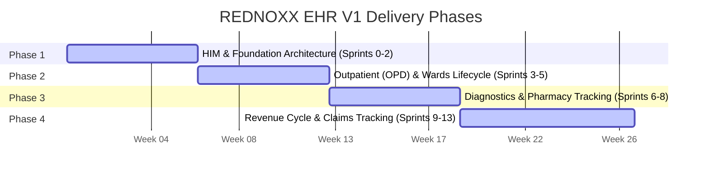

# PART VIII: Module Implementation Guide

## Purpose

This section defines the 26-week delivery lifecycle roadmap for the REDNOXX EHR V1 platform, split into four explicit delivery phases. Each phase enforces clear functional boundaries and strict data validation requirements for the sprint teams.

## Background

To manage the complexity of a dual-storage modular monolith, the implementation is strictly sequenced. Foundational identity systems must be stabilized before clinical workflows are introduced, which in turn must be finalized before revenue cycle components can map to them.

## Architecture

### Exhaustive Module Phasing Timeline

**Diagram Note:** The 26-week execution scope is split into four explicit delivery phases.

## Technical Specification

### Phase 1: HIM & Foundation Architecture

- **Timeline:** Weeks 1–6 (Sprints 0–2).
- **Objectives:** Establish primary application platforms, deploy database instances, configure identity validation architectures, and enforce foundational master records.
- **FHIR Resources:** Patient, Person.
- **Postgres Tables:** `users`, `roles`, `permissions`, `facilities`, `wards`, `beds`.
- **API Endpoints:** Patient Search API, Temporary Identifier Generation API.
- **Events:** Duplicate review request ingestion, patient merge confirmation.
- **Dependencies:** Core CI/CD pipeline and dual-storage container infrastructure must be operational.
- **Acceptance Criteria:**
    - Search-Before-Create logic blocks manual inputs to the registration form until a patient search query runs against the index.
    - Temporary emergency records bypass standard field constraints and generate an emergency tracking code using the pattern `TEMP-EMERG-YYYYMMDD-NNNN`.
    - The system blocks automatic patient record merges, routing duplicate candidates to a managed queue for authorized supervisor review.
- **Known Risks:** Uncontrolled manual merges corrupting the Master Patient Index, or unmonitored duplicate queues leading to fragmented clinical histories.

### Phase 2: Outpatient (OPD) & Wards Lifecycle

- **Timeline:** Weeks 7–12 (Sprints 3–5).
- **Objectives:** Deploy clinic queue structures, build full Admission-Discharge-Transfer (ADT) engines, configure beds, and manage clinical care documentation.
- **FHIR Resources:** Encounter, EpisodeOfCare, DocumentReference, Composition.
- **Postgres Tables:** Queue routing and department triage tracking records.
- **API Endpoints:** Encounter initialization API, Document Amendment handler.
- **Events:** Clinic check-in, consultation initiation.
- **Dependencies:** Phase 1 Master Patient Index (MPI) and practitioner identity boundaries.
- **Acceptance Criteria:**
    - When a clinician initiates a patient consultation, the internal service engine updates the state and automatically generates a corresponding FHIR `Encounter` resource inside Medplum.
    - The `Encounter.class` is set using the standard identity code `AMB` (ambulatory).
    - Finalized clinical forms require an electronic signature check, linking the entry directly to the practitioner's unique credential signature.
    - Signed clinical notes are locked against direct updates or silent overwrites, requiring an amendment workflow that binds a pointer reference to the previous original ID.
- **Known Risks:** Missing cryptographic signature hashes on finalized documents, or failure to properly link encounters to the correct active facility location.

### Phase 3: Diagnostics & Pharmacy Tracking

- **Timeline:** Weeks 13–18 (Sprints 6–8).
- **Objectives:** Implement end-to-end electronic diagnostic test loop monitoring, configure terminology mapping registries, and build secure e-prescribing tools.
- **FHIR Resources:** ServiceRequest, Specimen, DiagnosticReport, MedicationRequest, MedicationDispense, Observation.
- **Postgres Tables:** `inventory.stock_balances`, `inventory.stock_movements`.
- **API Endpoints:** Laboratory validation confirmation, E-prescribing submission.
- **Events:** Specimen collection logged, diagnostic report finalized, medication dispensed.
- **Dependencies:** LOINC and SNOMED-CT terminology standardization profiles.
- **Acceptance Criteria:**
    - Diagnostic test requests map directly to unique LOINC identifiers, and clinical findings map to SNOMED-CT concepts.
    - Laboratory results remain hidden from the patient chart until an authorized laboratory user completes the confirmation step, updating the `DiagnosticReport.status` to `final`.
    - The backend extracts internal medicine mapping codes from dispensed payload webhooks and passes them to the Postgres inventory database to deduct inventory using strict FIFO batch tracking logic rules.
- **Known Risks:** Value-set validation failures causing payload rejections, or inventory deduction race conditions if dispensing webhooks are processed out of order.

### Phase 4: Revenue Cycle & Claims Tracking

- **Timeline:** Weeks 19–26 (Sprints 9–13).
- **Objectives:** Deploy pricing rules engines, manage patient billing accounts, structure payer verification registers, and build automated claims extraction modules.
- **FHIR Resources:** ChargeItemDefinition, Invoice, Account, Claim, ClaimResponse, Coverage.
- **Postgres Tables:** `services`, `charge_items`, `tariffs`, `payer_rules`, `invoices`, `payments`, `claims`, `remittances`.
- **API Endpoints:** Insurance eligibility validation, Claims extraction generator.
- **Events:** Inbound financial charge capture.
- **Dependencies:** Completed Phase 2 and 3 workflows to provide clinical evidence trace links for billing.
- **Acceptance Criteria:**
    - Front desk check-in workflows query the `Coverage` resource state, mapping patient identity to verified insurance plan structures to confirm active coverage boundaries.
    - The pricing engine evaluates unbilled charges by checking active tariff listings against explicit sorting rules and effective dates.
    - Invoices are structured in Postgres to ensure trace links are logged for every charge component, keeping line items mapped directly back to the original clinical resource IDs.
    - Background routines parse itemized invoice summaries and compile compliant insurance claims format sets containing full evidence trace links.
- **Known Risks:** Broken trace links causing claims rejections from payers, or failure to properly evaluate primary payer status leading to incorrect patient co-payments.

## Implementation Notes

- Sprint teams must ensure that their respective API endpoints and backend translation logic are completely covered by automated regression tests before requesting a release architecture readiness review.
- Cross-team coordination is critical during Sprint 9, as the revenue cycle integration relies heavily on the exact JSON structures outputted by the clinical events developed in Phase 3.
