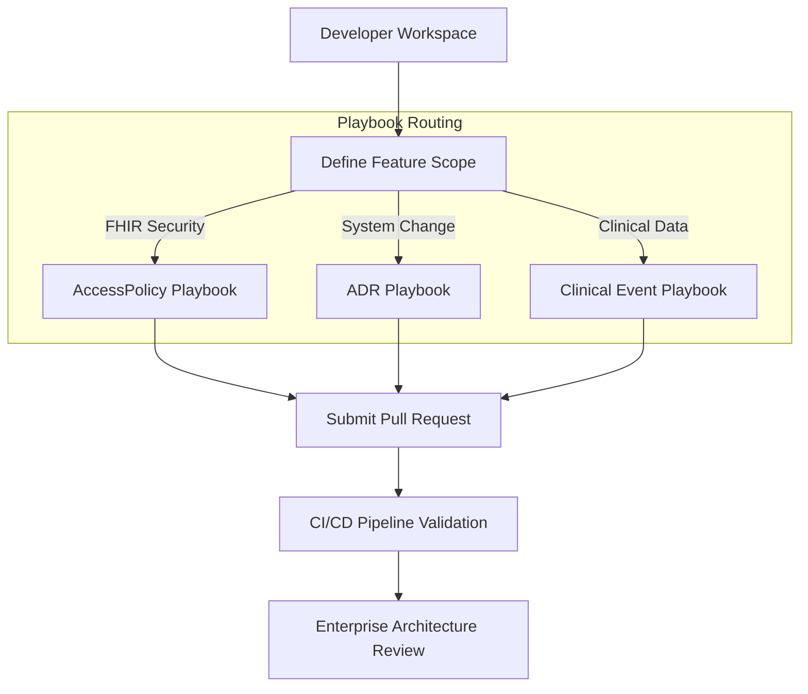

# PART IX: Developer Playbooks

## Purpose

This section establishes the standard operating procedures and developer playbooks for the REDNOXX EHR V1 platform. It provides actionable, step-by-step guidance for engineering teams to create modules, manage FHIR resources, and document architectural changes without bottlenecking delivery.

## Background

As the engineering teams scale across the dual-storage framework, maintaining consistency between the Laravel backend, the React/TypeScript frontend, and the Medplum clinical graph requires strict procedural guidelines. These playbooks serve as the baseline for onboarding developers and standardizing daily workflows.

## Architecture



**Diagram Note:** The standardized developer workflow for introducing changes via defined playbooks.

## Technical Specification

### Playbook 1: How to Create an AccessPolicy

- **Purpose:** To define secure, role-based boundaries for clinical and operational staff interacting with the Medplum FHIR graph.

- **Example:**

```json
{
    "resourceType": "AccessPolicy",
    "id": "pharmacist-dispense-policy",
    "name": "Clinical Pharmacist Access Policy",
    "resource": [
        {
            "resourceType": "MedicationRequest",
            "access": "read"
        },
        {
            "resourceType": "MedicationDispense",
            "access": "read-write"
        },
        {
            "resourceType": "Patient",
            "access": "read"
        }
    ]
}
```

- **Explanation:** This policy restricts a pharmacy user to read-only access for incoming MedicationRequest orders and Patient demographics, while granting read-write authority to process and finalize MedicationDispense records.

- **Production Notes:** Save this JSON file inside the `fhir/access-policies/` directory in the repository. Never embed these policies directly within the React frontend or Laravel backend application logic.

---

### Playbook 2: How to Write an ADR

- **Purpose:** To capture significant architectural decisions, data model changes, or framework adoptions in a standardized markdown format.

- **Example:**

```markdown
# ADR-014: Adoption of TypeScript and Vite for Frontend Tooling

## Context and Problem Statement

We need a fast, type-safe development environment for the clinical dashboards that guarantees payload alignment with our FHIR standards.

## Decision Outcome

Chosen option: React with TypeScript and Vite.

- Enforces strict type-checking against FHIR R4 interfaces.
- Vite provides immediate Hot Module Replacement (HMR) for rapid UI iteration.

## Consequences

- Good: Eliminates runtime payload structure errors before they reach the API gateway.
- Bad: Requires a steeper learning curve for developers unfamiliar with strict TypeScript generics.
```

### Playbook 3: How to Introduce a New Financial Event Migration

- **Purpose:** To safely migrate the Postgres schema for new clinical-to-financial billing events without locking production tables.

#### Execution Flow

1. Define the new operational capability in the canonical data dictionary.
2. Write a non-destructive SQL migration to create the relational structure.
3. Ensure the migration includes an up/down rollback path.

#### SQL Example

```sql
-- Up Migration: Adding Pharmacy Dispense Tracking
CREATE TABLE billing.pharmacy_charge_links (
    uuid UUID PRIMARY KEY DEFAULT gen_random_uuid(),
    charge_item_uuid UUID NOT NULL REFERENCES billing.charge_items(uuid),
    medication_dispense_fhir_id VARCHAR(255) NOT NULL,
    dispensed_at TIMESTAMP WITH TIME ZONE DEFAULT NOW()
);

CREATE INDEX idx_pharmacy_fhir_link
ON billing.pharmacy_charge_links(medication_dispense_fhir_id);
```

- **Discussion:** This table securely maps the `MedicationDispense` FHIR resource generated by the Medplum clinical graph directly to the financial ledger inside Postgres, preserving the partition boundary.

- **Failure Modes:** If the `CREATE INDEX` statement is omitted, lookups querying the billing status of a specific FHIR dispense ID will result in massive sequential scans, degrading the Postgres database performance during peak clinical hours.

---

### Playbook 4: How to Implement Cross-Domain Workflow Tracking

- **Purpose:** To trace clinical actions originating in the FHIR graph through the asynchronous integration layer into the Postgres financial ledger, ensuring observability and preventing silent revenue leakage.

#### Execution Flow

1. **Clinical Initiation:** A user finalizes a clinical action (e.g., completing a `ServiceRequest`). Medplum natively generates the resource and an accompanying `Provenance` record.
2. **Trace ID Injection:** The Medplum Bot intercepts the event and injects a unique correlation tracking header (e.g., `X-Workflow-Trace-ID`) into the outbound secure webhook payload.
3. **Financial Ledger Intercept:** The Laravel backend catches the webhook, applies the financial logic, and writes the `X-Workflow-Trace-ID` into the Postgres `outbox_events` table alongside the charge.

#### Example: Bot Webhook Payload

```json
{
    "event_type": "CLINICAL_CHARGE_CAPTURE",
    "source_system": "MEDPLUM_FHIR_SERVER",
    "source_event_id": "ServiceRequest/req-5541",
    "x_workflow_trace_id": "TRC-9982-AB-110",
    "patient_identifier": "fc3b92c4",
    "timestamp": "2026-07-06T18:00:00Z"
}
```

#### SQL Example

```sql
-- The trace ID is logged to guarantee cross-system correlation
INSERT INTO tracking.workflow_logs (
    trace_id,
    source_event_id,
    status,
    target_table,
    created_at
) VALUES (
    'TRC-9982-AB-110',
    'ServiceRequest/req-5541',
    'PROCESSED_TO_BILLING',
    'billing.charge_items',
    NOW()
);
```

- **Production Notes:** The `x_workflow_trace_id` must be indexed in Postgres. If an operations manager reports a missing charge, querying this single ID must instantly return the payload's status across the message queue and the database.

- **Failure Modes:** If a bot crashes before appending the trace ID, the payload becomes an orphan. Wrap bot webhook transmissions in standard TypeScript `try/catch` blocks that pipe errors directly to your observability dashboard.

---

### Playbook 5: How to Ingest Exhaustive Healthcare Terminologies

- **Purpose:** To securely upload massive terminology datasets (LOINC, SNOMED-CT, RxNorm, ICD-10) into the Medplum database for real-time validation and UI autocomplete without crashing the server.

#### Execution Flow

1. **Acquire Raw Data:** Download the raw release files directly from the governing bodies (e.g., the UMLS portal for SNOMED-CT and RxNorm, Regenstrief for LOINC).
2. **Use the Admin Import Endpoint:** Do not attempt to use standard `POST /CodeSystem` API requests for exhaustive lists. You must use the Medplum `$import` operation specifically built for bulk terminology ingestion.
3. **Validate the Ingestion:** Test the `$validate-code` and `$expand` endpoints to ensure the UI can query the newly indexed codes.

#### Example: API Request

```bash
curl -X POST 'https://[YOUR_MEDPLUM_URL]/fhir/R4/CodeSystem/$import' \
-H 'Authorization: Bearer [YOUR_ADMIN_TOKEN]' \
-H 'Content-Type: application/fhir+json' \
-d '{
  "resourceType": "Parameters",
  "parameter": [
    {
      "name": "system",
      "valueUri": "http://snomed.info/sct"
    },
    {
      "name": "concept",
      "valueAttachment": {
        "contentType": "text/csv",
        "url": "https://[YOUR_SECURE_STORAGE_URL]/snomed_concepts.csv"
      }
    }
  ]
}'
```

- **Explanation:** The `$import` operation accepts a CSV file of concepts and properties, bypassing standard JSON limitations to execute bulk inserts directly into the highly indexed Postgres terminology tables.

- **Production Notes:** Ingestion of millions of rows will take time. Run these imports during off-peak maintenance windows.

- **Failure Modes:** If the CSV format does not exactly match the expected schema (Code, Display, System), the import job will fail silently or map properties incorrectly, breaking the `$validate-code` checks in the clinical workflow.

### Playbook 6: How to Bootstrap the Rednoxx Environment

- **Purpose:** To configure the initial system state, establish the root project context, and securely provision backend access policies after a fresh server deployment.
- **Important Roles:** There is a root user (super admin) and a system admin. The super admin is only used for break-glass processes.

#### Execution Flow

The initial steps for generating PKCE challenges and authenticating are located in the FHIR processes documentation. Once you have obtained your bearer token, proceed with the following bootstrap sequence.

1. **Get Project Details**
   Retrieve the details of the existing project. The system automatically created a default project when the database was seeded.
   - **Request Type:** `GET`
   - **Endpoint:** `{{BASEURL}}/Project/[PROJECT_ID]`

2. **Rename Project**
   Patch the default project name to align with your enterprise configuration.
   - **Request Type:** `PATCH`
   - **Endpoint:** `{{BASEURL}}/Project/[PROJECT_ID]`
   - **Headers:**
     - `Content-Type: application/json-patch+json`
   - **Payload:**
     ```json
     [
       { 
         "op": "replace", 
         "path": "/name", 
         "value": "Rednoxx Super Admin Facility" 
       }
     ]
     ```

3. **Create Backend Access Policy**
   Create the policy defining the exact clinical resources the backend service is permitted to access.
   - **Request Type:** `POST`
   - **Endpoint:** `{{BASEURL}}/AccessPolicy/`
   - **Payload:**
     ```json
     {
         "resourceType": "AccessPolicy",
         "name": "REDNOXX Backend Policy",
         "resource": [
             { "resourceType": "Patient" },
             { "resourceType": "Encounter" },
             { "resourceType": "Observation" },
             { "resourceType": "Condition" },
             { "resourceType": "Procedure" },
             { "resourceType": "MedicationRequest" },
             { "resourceType": "DocumentReference" }
         ]
     }
     ```
   - **Production Notes:** Save this JSON file inside the `fhir/access-policies/` directory in the repository. Never embed these policies directly within the React frontend or Laravel backend application logic.

4. **Create Client Application**
   Register the backend application as a client and attach the AccessPolicy created in the previous step. (Note: Ensure you update the reference ID to match the newly generated AccessPolicy ID).
   - **Request Type:** `POST`
   - **Endpoint:** `{{BASEURL}}/ClientApplication/`
   - **Payload:**
     ```json
     {
         "resourceType": "ClientApplication",
         "name": "REDNOXX Backend",
         "description": "REDNOXX Backend Application Entry Point",
         "accessPolicy": {
             "reference": "AccessPolicy/[ACCESS_POLICY_ID]"
         }
     }
     ```

### Playbook 7: How to Execute the Backend Application Authentication Flow

- **Purpose:** To obtain a secure OAuth2 access token for the backend service (machine-to-machine authentication) immediately following the standard backend JWT auth. This allows the backend to securely interact with the FHIR graph on behalf of the system rather than a specific human user.

#### Execution Flow

Unlike the PKCE flow used for frontend human users, the backend application authenticates using the OAuth2 `client_credentials` grant. This exchange must be formatted as URL-encoded form data, not JSON.

1. **Request Backend Access Token**
   Exchange your registered client credentials for a bearer token.
   - **Request Type:** `POST`
   - **Endpoint:** `http://localhost:8103/oauth2/token`
   - **Headers:**
     - `Content-Type: application/x-www-form-urlencoded`
     - `Accept: application/json`
   - **Payload (URL Encoded):**
     - `grant_type: client_credentials`
     - `client_id: [CLIENT_ID]`
     - `client_secret: [CLIENT_SECRET]`

   **HTTP Example:**
   ```http
   POST /oauth2/token HTTP/1.1
   Host: localhost:8103
   Content-Type: application/x-www-form-urlencoded
   Accept: application/json

   grant_type=client_credentials&client_id=[CLIENT_ID]&client_secret=[CLIENT_SECRET]
   ```

   **Expected Response:**
   A successful request will return an access token that the backend must use for subsequent FHIR API calls.
   ```json
   {
       "access_token": "eyJhbGc...",
       "token_type": "Bearer",
       "expires_in": 3600
   }
   ```
   - **Production Notes:** Treat the `client_secret` identically to a production database password. It must be injected into the backend via environment variables (e.g., `.env`) and never hardcoded into the application logic or committed to version control.

## Implementation Notes

- All developers utilizing Docker for local environments must pull the latest `docker-compose.yml` to ensure their local Postgres and Medplum instances reflect the most recent playbook configurations.
- When introducing new terminologies (like specialized SNOMED-CT codes), developers must document the value sets in the FHIR architecture documentation before pushing mapping functions to the backend pipeline.

## Risks

- **Process Bypass:** Developers skipping the ADR playbook for "small" database or API changes will introduce undocumented drift between the target architecture and the actual codebase.
- **Test Omission:** Introducing new AccessPolicy files without corresponding integration tests could inadvertently lock valid users out of critical clinical resources (e.g., blocking a doctor from viewing an active encounter).

## Dependencies

- **Docs-as-Code Pipeline:** Requires MkDocs (or similar) to be successfully configured in the `.github/workflows/ci.yml` file to parse and publish these playbooks automatically.
- **Medplum CLI:** Required for developers to push new AccessPolicy or Subscription JSON files to their local or staging FHIR sandboxes for testing.

## References

- AGILE DELIVERY PLAN.docx
